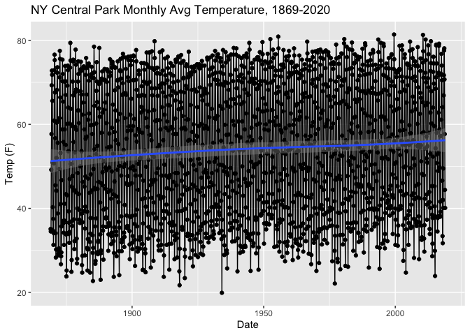
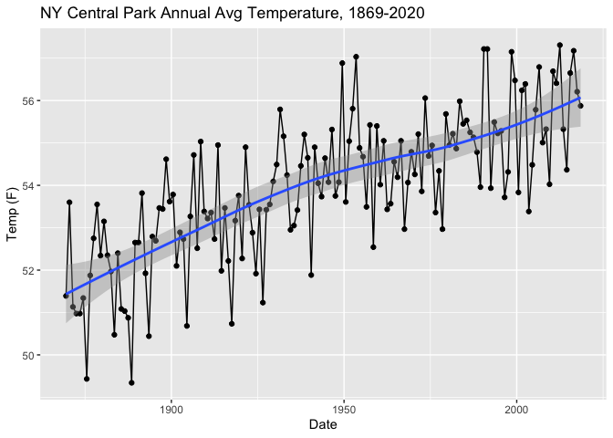
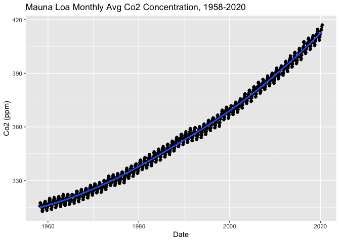
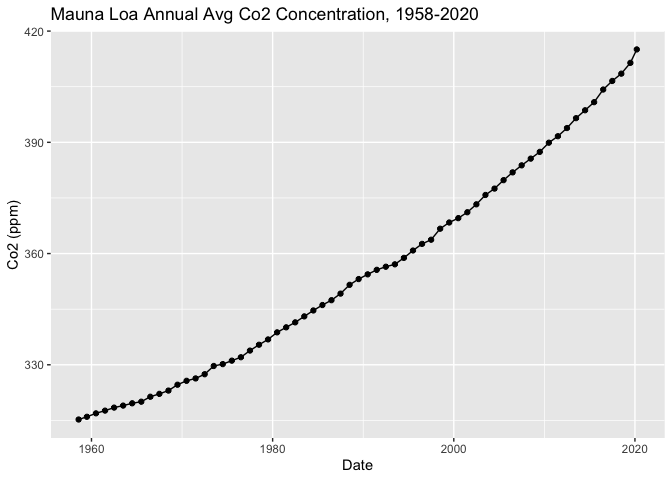
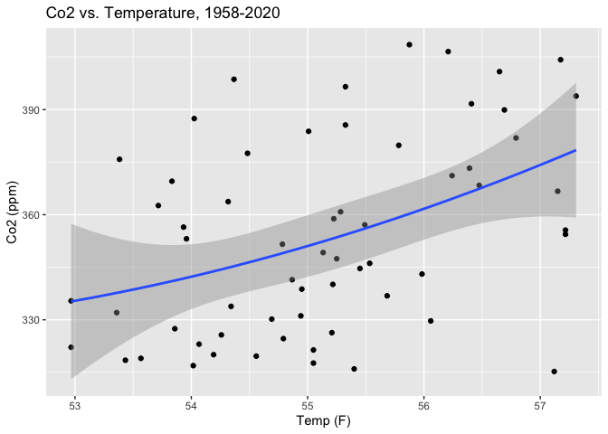
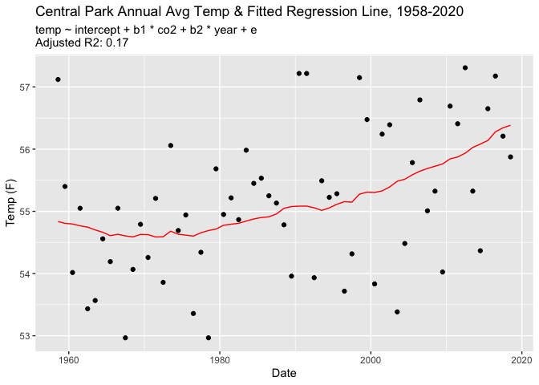

Climate Change in Central Park
================
Giovanni Colitti
6/27/2020

A friend of mine mentioned during a hike that there seemed to be no
relationship between the central park temperature data and carbon
dioxide emissions (otherwise known as global warming or climate change)
after accounting for seasonality. I was deeply skeptical and wanted to
take a look myself.

# Clean data

``` r
# Load central park temp data and reshape long
cp_temp <- read_csv("raw-data/central-park-temp-1869-2018.csv") %>%
  set_names(to_snake_case(names(.))) %>%
  pivot_longer(cols = jan:dec,
               names_to = "month",
               values_to = "temp_f_avg") %>% 
  mutate(
    month = match(month, tolower(month.abb)),
    date = make_date(
      year = year,
      month = month,
      day = days_in_month(make_date(year = year, month = month)) / 2 # get average day for each month
    )
  ) %>%
  select(-c(year, month))
```

    ## Rows: 150 Columns: 13

    ## ── Column specification ──────────────────────────────────────────────────────────────────────────────────────────────────────────────────────────────────
    ## Delimiter: ","
    ## dbl (13): Year, Jan, Feb, Mar, Apr, May, Jun, Jul, Aug, Sep, Oct, Nov, Dec

    ## 
    ## ℹ Use `spec()` to retrieve the full column specification for this data.
    ## ℹ Specify the column types or set `show_col_types = FALSE` to quiet this message.

``` r
glimpse(cp_temp)
```

    ## Rows: 1,800
    ## Columns: 2
    ## $ temp_f_avg <dbl> 35.1, 34.5, 34.8, 49.2, 57.7, 69.3, 72.8, 71.8, 65.6, 50.9, 40.3, 34.7, 37.5, 31.3, 34.1, 50.7, 60.9, 72.9, 76.6, 75.3, 67.6, 56.7, 4…
    ## $ date       <date> 1869-01-15, 1869-02-14, 1869-03-15, 1869-04-15, 1869-05-15, 1869-06-15, 1869-07-15, 1869-08-15, 1869-09-15, 1869-10-15, 1869-11-15, …

``` r
# Load mauna loa co2 data
ml_co2 <- read_csv("raw-data/mauna-loa-co2-1958-2020.csv") %>%
  mutate(
    date = make_date(
      year = year,
      month = month,
      day = days_in_month(make_date(year = year, month = month)) / 2
    ),
    average = if_else(average == -99.99, interpolated, average)
  ) %>%
  select(date, average) %>%
  rename(co2_ppm_avg = average) 
```

    ## Rows: 747 Columns: 7

    ## ── Column specification ──────────────────────────────────────────────────────────────────────────────────────────────────────────────────────────────────
    ## Delimiter: ","
    ## dbl (7): year, month, decimal date, average, interpolated, trend, ndays

    ## 
    ## ℹ Use `spec()` to retrieve the full column specification for this data.
    ## ℹ Specify the column types or set `show_col_types = FALSE` to quiet this message.

``` r
glimpse(ml_co2)
```

    ## Rows: 747
    ## Columns: 2
    ## $ date        <date> 1958-03-15, 1958-04-15, 1958-05-15, 1958-06-15, 1958-07-15, 1958-08-15, 1958-09-15, 1958-10-15, 1958-11-15, 1958-12-15, 1959-01-15,…
    ## $ co2_ppm_avg <dbl> 315.71, 317.45, 317.50, 317.10, 315.86, 314.93, 313.20, 312.66, 313.33, 314.67, 315.62, 316.38, 316.71, 317.72, 318.29, 318.15, 316.…

# Visualize Central Park Temperature Data

``` r
cp_temp %>% 
  ggplot(aes(x = date, y = temp_f_avg)) +
  geom_point() +
  geom_line() +
  geom_smooth(method = "loess") +
  ylab("Temp (F)") +
  xlab("Date") +
  ggtitle("NY Central Park Monthly Avg Temperature, 1869-2020")
```

    ## `geom_smooth()` using formula 'y ~ x'

<!-- -->

This graph shows a large seasonal fluctuation in temperature relative to
the linear trend in temperature (I think this may have been what my
friend was actually referring to). However, it’s still possible to see
that mean temperatures are increasing over time.

``` r
cp_temp %>% 
  group_by(year(date)) %>%
  summarise_all(mean) %>%
  ungroup() %>%
  ggplot(aes(x = date, y = temp_f_avg)) +
  geom_point() +
  geom_line() +
  geom_smooth(method = "loess") +
  ylab("Temp (F)") +
  xlab("Date") +
  ggtitle("NY Central Park Annual Avg Temperature, 1869-2020")
```

    ## `geom_smooth()` using formula 'y ~ x'

<!-- -->

# Visualize Mauna Loa Co2 Data

``` r
ml_co2 %>% 
  ggplot(aes(x = date, y = co2_ppm_avg)) +
  geom_point() +
  geom_line() +
  geom_smooth(method = "loess") +
  ylab("Co2 (ppm)") +
  xlab("Date") +
  ggtitle("Mauna Loa Monthly Avg Co2 Concentration, 1958-2020")
```

    ## `geom_smooth()` using formula 'y ~ x'

<!-- -->

``` r
ml_co2 %>% 
  group_by(year(date)) %>%
  summarise_all(mean) %>%
  ungroup() %>%
  ggplot(aes(x = date, y = co2_ppm_avg)) +
  geom_point() +
  geom_line() +
  ylab("Co2 (ppm)") +
  xlab("Date") +
  ggtitle("Mauna Loa Annual Avg Co2 Concentration, 1958-2020")
```

<!-- -->

Looks like Co2 is increasing…

``` r
d_annual <- ml_co2 %>% 
  inner_join(cp_temp, by = "date") %>% 
  group_by(year(date)) %>% 
  summarise_all(mean)

d_annual %>% 
  ggplot(aes(temp_f_avg, co2_ppm_avg)) +
  geom_point() +
  geom_smooth(formula = y ~ poly(x, 2), method = "lm") +
  ylab("Co2 (ppm)") +
  xlab("Temp (F)") +
  ggtitle("Co2 vs. Temperature, 1958-2020")
```

<!-- -->

# Modeling

This is not a serious attempt at modeling the relationship. I regress
the natural log of temperature on the natural log of co2 (an elasticity)
and a linear time trend.

``` r
fit <- lm(data = d_annual, formula = log(temp_f_avg) ~ log(co2_ppm_avg) + year(date))
summary(fit)
```

    ## 
    ## Call:
    ## lm(formula = log(temp_f_avg) ~ log(co2_ppm_avg) + year(date), 
    ##     data = d_annual)
    ## 
    ## Residuals:
    ##       Min        1Q    Median        3Q       Max 
    ## -0.038592 -0.013504  0.003074  0.011300  0.040815 
    ## 
    ## Coefficients:
    ##                   Estimate Std. Error t value Pr(>|t|)    
    ## (Intercept)       4.416956   0.955949   4.620 2.18e-05 ***
    ## log(co2_ppm_avg)  0.488164   0.325443   1.500    0.139    
    ## year(date)       -0.001645   0.001427  -1.153    0.254    
    ## ---
    ## Signif. codes:  0 '***' 0.001 '**' 0.01 '*' 0.05 '.' 0.1 ' ' 1
    ## 
    ## Residual standard error: 0.01923 on 58 degrees of freedom
    ## Multiple R-squared:  0.1978, Adjusted R-squared:  0.1701 
    ## F-statistic: 7.148 on 2 and 58 DF,  p-value: 0.001679

``` r
pred <- d_annual %>% mutate(pred = predict(fit, newdata = d_annual))

ggplot() + geom_point(data = d_annual, aes(x = date, y = temp_f_avg)) + 
  geom_line(data = pred, aes(x = date, y = exp(pred)), color = "red") +
  labs(subtitle = paste0("temp ~ intercept + b1 * co2 + b2 * year + e \n", 
  "Adjusted R2: ", summary(fit)$adj.r.squared %>% round(3))) +
  ylab("Temp (F)") +
  xlab("Date") +
  ggtitle("Central Park Annual Avg Temp & Fitted Regression Line, 1958-2020")
```

<!-- -->

Indeed, there is a relationship between annual average central park
temperatures and Co2 emissions.
